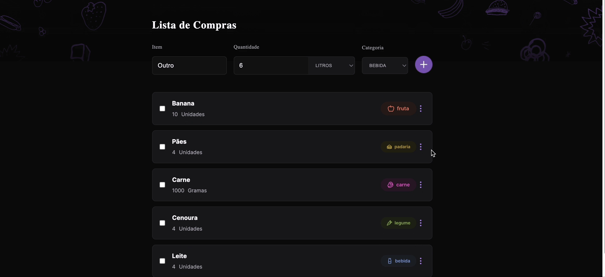

<h1 align="center"> #34 Shopping list</h1>

#34 challenge <a href="https://boracodar.dev/">#BORACODAR</a> from RocketSeat 

  <a href="#-tecnologias">Technologies</a>&nbsp;&nbsp;&nbsp;|&nbsp;&nbsp;&nbsp;
  <a href="#-projeto">Project</a>&nbsp;&nbsp;&nbsp;|&nbsp;&nbsp;&nbsp;
  <a href="#-layout">Layout</a>&nbsp;&nbsp;&nbsp;|&nbsp;&nbsp;&nbsp;
  <a href="#-collaborators">Collaborators</a>&nbsp;&nbsp;&nbsp;|&nbsp;&nbsp;&nbsp;

 

  

## 🚀 Technologies

This project was developed using the following technologies:

- HTML
- CSS
- JavaScript
- React
- Git e Github
- Figma
- Next

## 💻 Project

The project _Shopping list_ was carried out as part of the #34 challenge #BORACODAR from RocketSeat suggested by <a href="https://github.com/maykbrito" alt="Link para o GitHub do professor Mayk Brito" target="_blank">Mayk Brito</a>. The project uses a GitHub API to retrieve user data.

_<h2 align="center" ><a href="https://shopping-list-rickazuo.vercel.app/" target="_blank">Visit the project online</a></h2>_

## 📃 Collaborators

This challange was made by [Julia](https://gsajulia.github.io) and [Ricardo](https://rickazuo.github.io/portfolio/)
